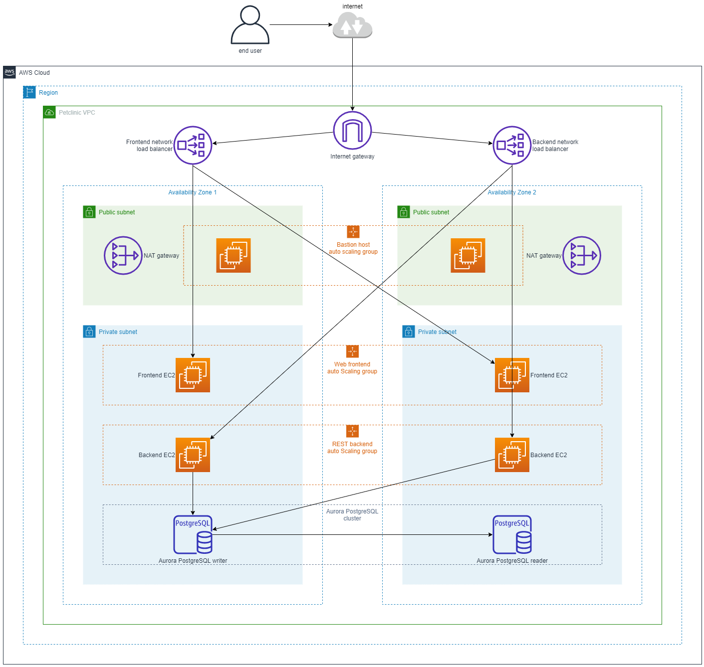

# cfn-petclinic-ha
Deploys HA spring-petclinic application on AWS CloudFormation. 

## Application stack
- Frontends: nginx & [spring-petclinic-angular](https://github.com/spring-petclinic/spring-petclinic-angular)
- Backends: [spring-petclinic-rest](https://github.com/spring-petclinic/spring-petclinic-rest)
- Database: Aurora PostgreSQL

## Access
### Web
The URL for the petclinic web interface is in the outputs section, named `FrontendURL`.

### SSH
To log onto any of the servers, first SSH onto a bastion host using the SSH key you selected when you built the stack. From there, you can SSH onto any of the servers in the private subnets using the same SSH key (note - you will need to add the private key to the bastion host manually).

### Database
To access the database, log onto any backend server using the procedure described in *SSH access*, and use the psql command to connect to the `petclinic` database with the `petclinic` user and the password you entered in the parameters section. The database DNS & port are in the outputs section under DatabaseEndpoint & DatabasePort.

Example login command (enter password when prompted):

`psql -W -h DatabaseEndpoint -p DatabasePort -U petclinic petclinic`

## High level architecture
*For the purposes of simplicity, SSH & web access flows are not shown*

## Server config
### Backend
Service petclinic-backend.service runs the petclinic backend server. Content is stored in /apps/petclinic-backend.
### Frontend
The frontend web content is served by Nginx. Content is stored in /apps/petclinic-frontend. 

## Listening ports
- Backend API - TCP 9966
- Frontend web server - TCP 80
- PostgreSQL database - 5432